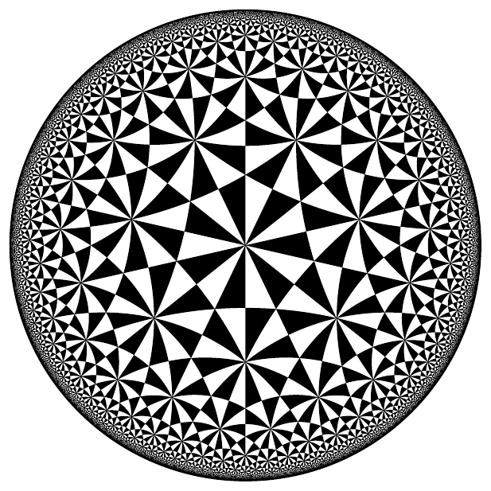

# Lua Hyperbolic Geometry

**luahyperbolic** is a LaTeX package and a Lua library for performing operations in hyperbolic geometry, intended for use with LuaLaTeX (LuaTeX). The package provides complex number manipulation and hyperbolic geometric functions.



## Installation

### Manual Installation (for now)

If you wish to install the package manually, follow these steps:

- Pu the file `luahyperbolic.sty` in your working directory
- Include the package in your document by running:

  ```latex
  \usepackage{luahyperbolic}
  ```

### Example Usage

A MWE is (see `minimal_example.tex`in `examples/`) :

```latex
\documentclass[margin=.2cm,multi,tikz]{standalone}
\usepackage{luahyperbolic} %loads luacode package
\begin{document}
\begin{luacode*}
hyper.tikzBegin("scale=2.5")
local P = complex(0.5,-0.2)
local A = complex.exp_i(math.pi/10)
for k=1,5 do hyper.drawLine(P, A^k, "teal") end
hyper.labelPoint(P, "$P$", "left=.2cm")
hyper.drawLine(complex.J,-complex.I,"very thick, dashed, red")
hyper.tikzEnd()
\end{luacode*}
\end{document}
```

Compiling that file with `lualatex` produces the following output:


See the [package manual (pdf)](doc/documentation-luahyperbolic.pdf) for numerous examples.

More examples in [examples/](examples/)

## License

This package is released under the **Public Domain (CC0 1.0 Universal License)**. You may use, modify, and distribute it freely, without restriction.

For more information on the license, see the `LICENSE` file or visit [CC0 1.0 Universal](https://creativecommons.org/publicdomain/zero/1.0/).

## Todo

### In `luahyperbolic-core` :

- function distance_between_geodesics(z1, z2, w1, w2)
- function closest_points_between_geodesics(z1, z2, w1, w2)
- triangle intouch points, extouchpoints
- triangle orthocenter
- camelCase syntax for public functions and prefixing 'semipublic' functions with "\_"
- hide functions metric_factor, circle_to_euclidean
- get rif of cosh, sinh, tanh
- IMPORTANT rewrite functions that compare distances, do not compute atanh, just compare tanh of distance !
- IMPORTANT write function that computes triangle with given angles. Necessary for (p,q,r) tilings.
- change name fundamentalIdealTriangle if only one angle is zero
- power of a point, radical axis

### In `luahyperbolic-tikz` :

- function `drawExcircle` and variants
- more triangle geometry ? Gergonne, Nagel etc ?
- function `drawHypercycle` and variants
- function `markSegment` ?
- function `markAngle(A, O, B, options)`
- function `labelSegment(A, B, label)`
- function `labelAngle(A, O, B, label)`
- more tikz shapes if necessary
- draw external angle bisector ?
- replace old `complex.coerce` and assert in disk with `_coerce_assert_in_disk`
- replace old `complex.isClose(z,w)` etc with `z:isNear(w)` etc.

### In documentation

- hypercycles for hyperbolic automorphisms

### Elsewhere

- write more examples !
- tilings with other types of degenerate triangles, including ideal triangles

## Contact

Don't contact me
