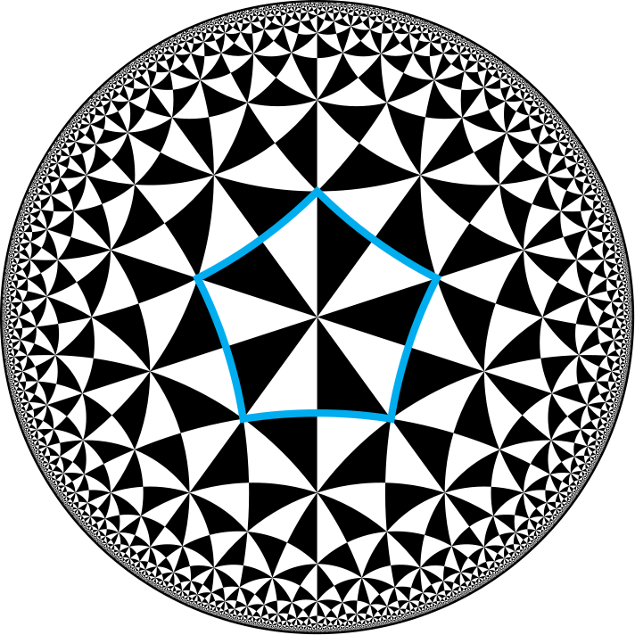
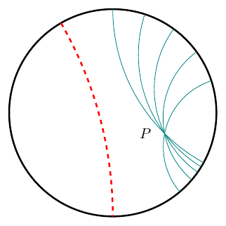

# Lua Hyperbolic Geometry

Version on CTAN: 2026/03/16 (commit 19a9fd9915fb2824c35f4fb73e823789f0cf7cd9)

> [!Note]
> Luahyperbolic is still in an early development phase.
> Changes and bug fixes are happening frequently, check the [CHANGELOG.md](CHANGELOG.md).

**luahyperbolic** is a LaTeX package and a Lua library for performing operations and drawing pictures in hyperbolic geometry, intended for use with LuaLaTeX. The package provides complex number manipulation and hyperbolic geometric functions.



## Example Usage

A minimal working example is (see `minimal_example.tex`in `examples/`) :

```latex
\documentclass[margin=.2cm,multi,tikz]{standalone}
\usepackage{luahyperbolic} %loads luacode package
\begin{document}
\begin{luacode*}
hyper.tikzBegin("scale=2.5")
local P = complex(0.5,-0.2)
local A = complex.exp_i(math.pi/10)
for k=1,5 do hyper.drawLine(P, A^k, "teal") end
hyper.labelPoint(P, "$P$", "left=.2cm")
hyper.drawLine(complex.J,-complex.I,"very thick, dashed, red")
hyper.tikzEnd("myfile.tikz")
\end{luacode*}
\end{document}
```

Compiling that file with `lualatex` produces the following output:



It also saves the TikZ picture to `myfile.tikz`, for later use. (Optional)

See the [package documentation (pdf)](documentation-luahyperbolic.pdf) for numerous examples.

More examples in [examples/](examples/)

## License

This package is released under the **Public Domain (CC0 1.0 Universal License)**. You may use, modify, and distribute it freely, without restriction.

For more information on the license, see the `LICENSE` file or visit [CC0 1.0 Universal](https://creativecommons.org/publicdomain/zero/1.0/).

## Installation

### Quick use (no installation)

The simplest way to use the package is to place the file: `luahyperbolic.sty` in the same directory as your `.tex` document.

Then include it with:

```latex
\usepackage{luahyperbolic}
```

---

### User installation (recommended)

To make the package available to all your documents, install it in your personal TEXMF tree.

1. Find your TEXMFHOME directory:

   ```bash
   kpsewhich -var-value=TEXMFHOME
   ```

2. Copy the file to:

   ```
   <TEXMFHOME>/tex/latex/luahyperbolic/
   ```

If the directory does not exist, create it.

3. No further action is usually required; LaTeX will automatically find the package.

---

### System-wide installation (advanced)

To install the package for all users, place it in the local TeX tree (requires administrative privileges):

```
/usr/local/texlive/texmf-local/tex/latex/luahyperbolic/
```

Then refresh the file database:

```bash
sudo mktexlsr
```

---

### Notes

- Do **not** place files in `texmf-dist`, as this directory is managed by your TeX distribution and may be overwritten during updates.
- This package is not currently part of TeX Live or MiKTeX.

## Todo

### In `complex` :

- `complex.round(z,nb_decimals)` and similar functions ? The, replace quantization in `luahyperbolic-tilings`.

### In `luahyperbolic-core` :

- function distance_between_geodesics(z1, z2, w1, w2)
- function closest_points_between_geodesics(z1, z2, w1, w2)
- triangle intouch points, extouchpoints, excenters
- hide functions metric_factor, circle_to_euclidean
- get rif of cosh, sinh, tanh
- IMPORTANT write function that computes triangle with given angles. Necessary for (p,q,r) tilings.
- change name fundamentalIdealTriangle if only one angle is zero
- power of a point, radical axis
- hyper.getType(phi) for automorphism
- hyper.getFixedPoints(phi) for automorphism
- symmetrySending (A to B)
- reflectionSending (A to B)
- expMap : transforme into function of type point -> (vector -> point) instead of (point, vector) -> point

### In `luahyperbolic-tikz` :

- add more constants : distances for angle drawing/labelling etc,
- add function `drawExcircle` and variants
- add function `markAngle(A, O, B, options)`
- add function `labelSegment(A, B, label)`
- add function `labelAngle(A, O, B, label)`
- add function fillTriangle, fillPolygon, fillCircle, fillHalfSpace
- more tikz shapes if necessary
- draw external angle bisector ?
- drawExcircle
- more triangle geometry ? Gergonne, Nagel etc ?
- replace old `complex.isClose(z,w)` etc with `z:isNear(w)` etc.

### In `luahyperbolic-tilings`

- faster tiling generation
- draw tiling step by step, triangle by triangle
- draw uniform tiling
- draw circle packing

### In documentation

- links to math articles on wikipedia for definitions ?

### More examples

- ex circles

## Contact

Do you really need to contact me ? Please don't contact me.
